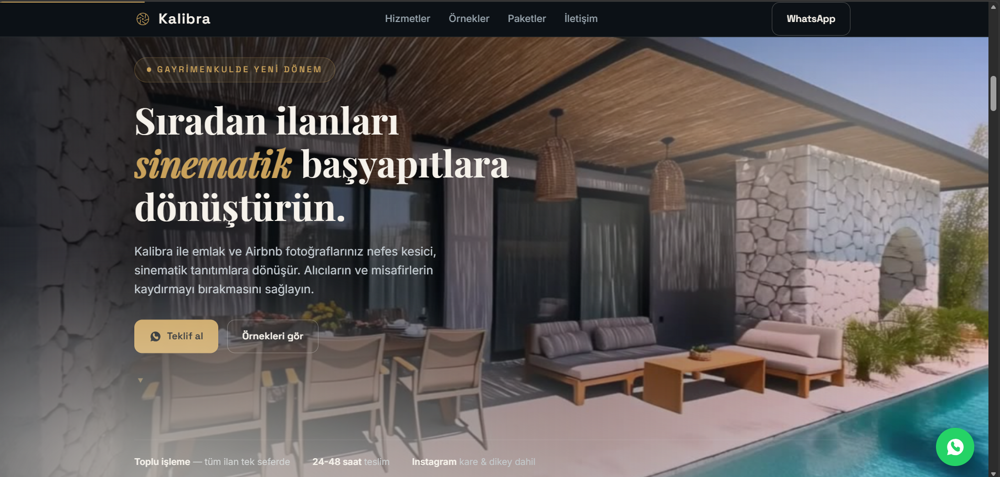
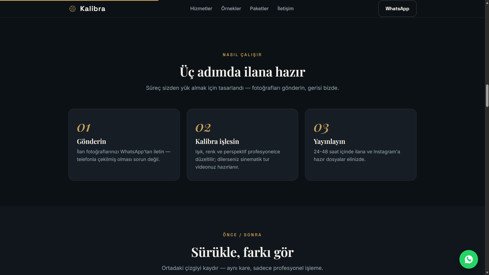
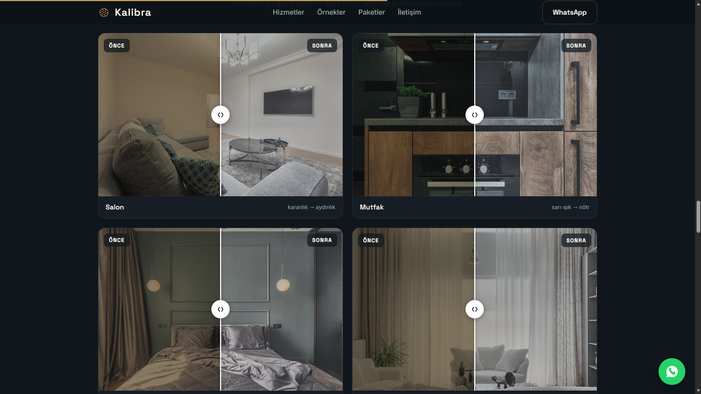
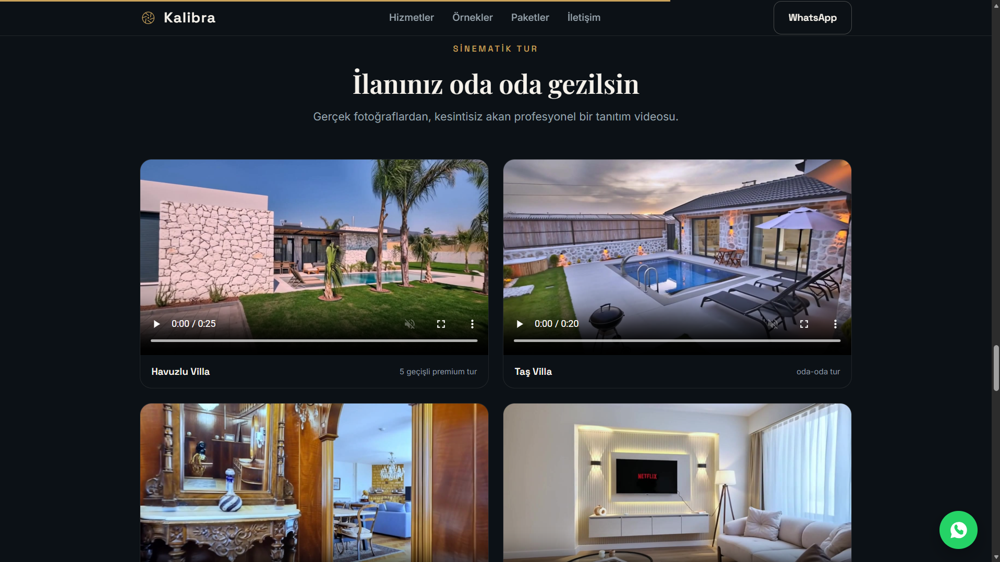
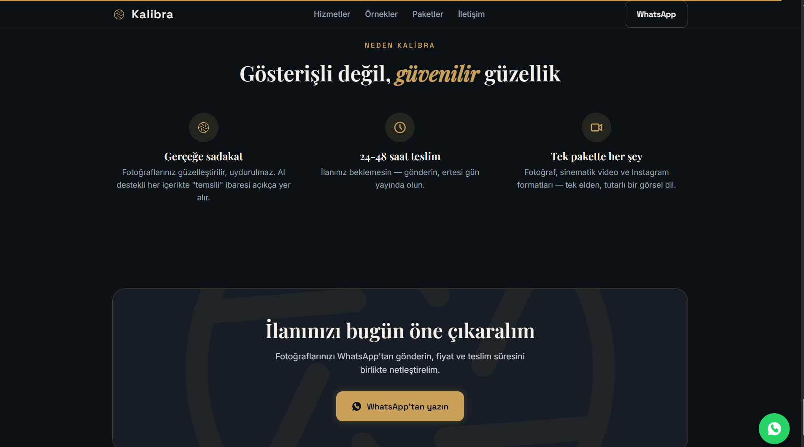

# 🏠 Kalibra — Emlak & Airbnb Fotoğraf İyileştirme

> 🔒 **Bu proje ticari olarak geliştirilmektedir — kaynak kodu kapalıdır.** Demo veya detaylı bilgi için [iletişime geçebilirsiniz](#-i̇letişim).

Emlak ilanları ve Airbnb listeleri için fotoğrafları otomatik iyileştiren, gerçek fotoğraflardan sinematik tanıtım videoları üreten yapay zekâ destekli sistem. Sıradan telefon fotoğraflarını profesyonel ilan kalitesine taşır.

## ✨ Özellikler

- **Otomatik fotoğraf iyileştirme** — ışık, renk ve perspektif düzeltmesi (karanlık → aydınlık, sarı ışık → nötr)
- **Sinematik tur videoları** — ilan fotoğraflarından oda oda gezilen, geçişli tanıtım videoları
- **Toplu işleme** — tüm ilan fotoğraflarının tek seferde işlenmesi
- **Çoklu format çıktı** — ilan, Instagram kare ve dikey (reels) formatları
- **Gerçeğe sadakat** — fotoğraflar güzelleştirilir, uydurulmaz

## 🖼️ Ekran Görüntüleri

**Nasıl çalışır** — üç adımda ilana hazır:

**Önce / Sonra** — aynı kare, sadece profesyonel işleme:

**Sinematik tur** — gerçek fotoğraflardan üretilen tanıtım videoları:

**Neden Kalibra:**

## 🎯 Kimin İçin?

- Emlak ofisleri ve danışmanlar
- Airbnb / kısa dönem kiralama ev sahipleri
- Villa kiralama işletmeleri

## 🛠️ Teknolojiler

`Python` · `Görüntü İşleme` · `Video Üretimi` · `HTML/CSS/JS`

## 📫 İletişim

